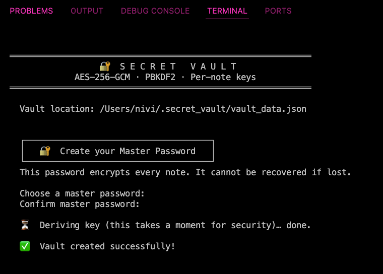
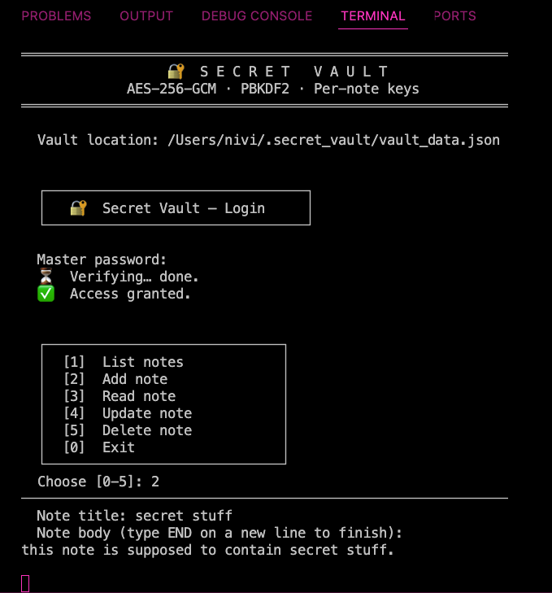

# 🔐 Secret Vault

A command-line encrypted notes app written in Python. Every note is protected with **AES-256-GCM** encryption and a unique key derived from your master password via **PBKDF2-HMAC-SHA256** — so even if someone gets your vault file, they get nothing without your password.

---

## ✨ Features

| Feature | Detail |
|---|---|
| **AES-256-GCM encryption** | Authenticated encryption — detects tampering |
| **PBKDF2 key derivation** | 600,000 iterations (OWASP 2023 recommended) |
| **Per-note encryption keys** | Each note has its own salt + derived key |
| **Master password never stored** | Only a SHA-256 verifier is saved to disk |
| **Atomic writes** | Vault file is written safely (write-then-rename) |
| **Multi-line notes** | Write notes as long as you like |

---

## 🗂 Project Structure

```
secret-vault/
├── vault/
│   ├── crypto.py      # AES-GCM encrypt/decrypt + PBKDF2 key derivation
│   ├── storage.py     # JSON vault file read/write
│   ├── auth.py        # Master password setup, login, session
│   └── notes.py       # Note CRUD (add, read, update, delete)
├── main.py            # CLI entry point
├── requirements.txt
└── .gitignore
```

---

## 🚀 Getting Started

### 1. Clone the repo

```bash
git clone https://github.com/your-username/secret-vault.git
cd secret-vault
```

### 2. Create a virtual environment

```bash
python -m venv .venv
source .venv/bin/activate        # macOS/Linux
.venv\Scripts\activate           # Windows
```

### 3. Install dependencies

```bash
pip install -r requirements.txt
```

### 4. Run the app

```bash
python main.py
```

On first run you'll be prompted to create a master password. After that, the encrypted vault file is stored at:

```
~/.secret_vault/vault_data.json
```

---


## 📋 Usage

```
  [1]  List notes       — show all note IDs and titles
  [2]  Add note         — write and encrypt a new note
  [3]  Read note        — decrypt and display a note by ID
  [4]  Update note      — edit title or body (re-encrypted with fresh salt)
  [5]  Delete note      — permanently remove a note
  [0]  Exit             — lock the vault and quit
```

---

## ⚠️ Important Notes

- **Your master password cannot be recovered.** If you forget it, your notes are gone.
- **Do not commit `~/.secret_vault/`** — your vault file contains your encrypted notes. The `.gitignore` already excludes it.
- This project is for **learning purposes**. For production secrets management, consider tools like [age](https://github.com/FiloSottile/age) or [HashiCorp Vault](https://www.vaultproject.io/).

---

## 🛠 Tech Stack

- **Python 3.11+**
- [`cryptography`](https://cryptography.io/) — AES-GCM, PBKDF2
- `hashlib`, `uuid`, `json`, `getpass` — all stdlib

---

## Demo Images

| | |
|Password Creation|Note Operations|
|  |  |

## 📄 License

This project is intended for educational and cybersecurity learning purposes.